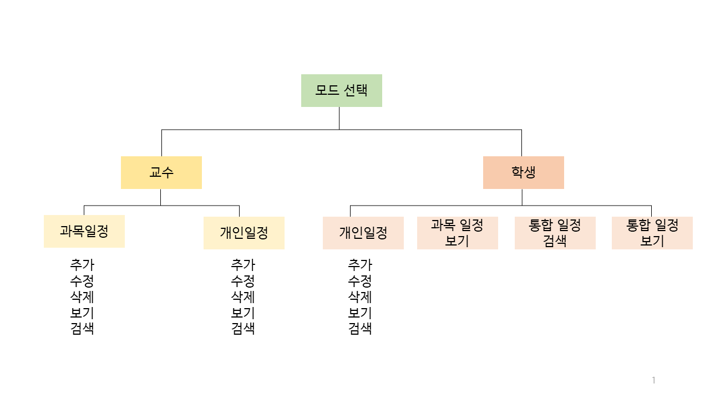

# Plan Helper

: 학교 일정과 개인 일정을 한 번에 볼 수 있는 플래너로 교수 버전과 학생버전이 있다.

1. ##### Plan Helper Auth(서버, 클라이언트 프로그램): 인증 기능 구현

2. ##### Plan Helper SubjectTransmission(서버, 클라이언트)

   ##### : 교수가 과목일정 업로드 후 학생이 접속하면 일정 자동 업데이트 기능 구현

~~1, 2 동시에 구현 실패..~~

------

​	개발환경: Linux

​	개발 툴: Vim, gcc

​	개발 언어: C

------

### 주요 기능

#### 	1단계: 기본 다이어리 기능

​		개인 일정 추가/삭제/수정 기능

​		과목 일정 추가/삭제/수정 기능

#### 	2단계: 공유 다이어리 기능

​		클라이언트 프로그램의 학생 ver: 과목 일정 자동 업데이트

​		클라이언트 프로그램의 교수 ver: 과목 일정 변경 자동 업로드

​		개인/과목 일정 통합 검색

#### 	3단계: 알림기능

​		공통: 당일 일정 알림

​		학생 ver: 과목 업데이트 알림

------

### 기능 트리



------

### Usage

- PlanHelper - Authenticity

  ```
  @linux~/PlanHelper/authentication/server$ ./a.out [port number]
  ```

  ```
  @linux~/PlanHelper/authentication/client$ ./client [same port number]
  ```


- PlanHelper - Subject Schedule Transmission

  ```
  @linux~/PlanHelper/subjectTransmission/server$ ./a.out [port number]
  ```

  ```
  @linux~/PlanHelper/subjectTransmission/clientF$ ./c10 [same port number]
  ```

  

------

### API reference

Authentication API in "func_servAC.c"

​	char* decideMode (int mode) : 클라이언트의 모드를 확인(교수/학생)

​	char* checkID (char* modefile, char* id) : 아이디를 확인합니다.

​	char* checkClient(char* msg) : 클라이언트에게 인증 결과를 알려줍니다.

Socket Connection API

​	void sndPlan (int cliSockFd, char* subjectFileName) : 소켓으로 과목 일정 파일 전송

​	void rcvPlan (int cliSockFd, char* subjectFileName) : 소켓으로 과목 일정 파일 수신

​	void* serverMenu (void* arg): 서버 스레드 루틴, arg: client socket file descripter의 포인터


